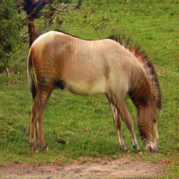
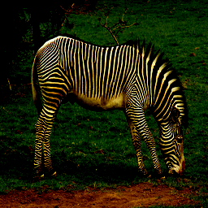
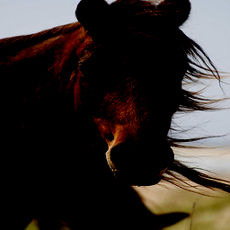
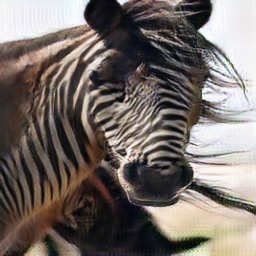

# CycleGAN
This is a quick implementation of paper [Unpaired Image-to-Image Translation
using Cycle-Consistent Adversarial Networks](https://arxiv.org/pdf/1703.10593.pdf)

## Some results
#### zebra-to-horse

### horse-to-zebra

